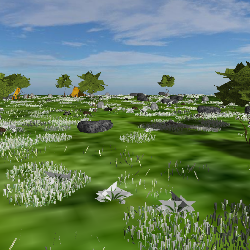

# Py3D-World


## Description

This project serves to illustrate how to render a 3D-Textured, Environment Engine utlizing Python, OpenGL, and some GLSL. It is based off two projects two seperate projects. The first being StanislavPetrovV's [3D-Graphics-Engine Project](https://github.com/StanislavPetrovV/3D-Graphics-Engine) and the second being a prior project that I initially created for in my Computer Graphics Class at Texas Wesleyan Univerity for the Spring Semester of 2022. The purpose for developing this project is to act as two things:

1. To illustrate how Python can be used to render Computer Graphics for the Purposes of Simulation Programming
2. To act as a template for anyone to use in the future.

# ScreenShots



## Table of Contents

1. Dependencies
   - [PyGLM](#PyGLM)
   - [Moderngl](#ModernGl)
   - [Numpy](#Numpy)
   - [PyGame](#PyGame)
   - [Pywavefront](#PyWavefront)
2. [What is a VAO (Vertex Array Object)?](#VAO)
3. [What is a VBO? (Vertex Buffer Object)?](#VBO)
4. [Classes](#Classes)
   - [Camera](#Camera)
   - [GraphicsEngine](#GraphicsEngine)
   - Model Classes
      -  [AdvacedSkybox](#AdvacedSkybox)
      -  [BaseModel](#BaseModel)
      -  [Camel](#Camel)
      -  [Cactus](#Cactus)
      -  [Cube](#Cube)
      -  [ExtendedBaseModel](#ExtendedBaseModel)
      -  [Grass](#Grass)
      -  [Grass_Patch](#Grass_Patch)
      -  [MilitaryVehicle](#MilitaryVehicle)
      -  [MovingCube](#MovingCube)
      -  [Plane](#Plane)
      -  [Plane_Dirt](#Plane_Dirt)
      -  [Plane_Grass](#Plane_Grass)
      -  [Plane_Sand](#Plane_Sand)
      -  [Pyramid](#Pyramid)
      -  [Skybox](#Skybox)
      -  [SmallRock](#SmallRock)
      -  [Stone_A](#Stone_A)
      -  [Stone_B](#Stone_B)
      -  [Stone_C](#Stone_C)
      -  [Tent](#Tent)
      -  [TreeBottom](#TreeBottom)
      -  [TreeTop](#TreeTop)
      -  [TreeTrunk](#TreeTrunk)
   - [Scene](#Scene)
   - [Texture](#Texture)
   - [VAO](#VAO)
   - VBO Classes
      - [AdvancedSkyboxVBO](#AdvancedSkyboxVBO)
      - [BaseVBO](#BaseVBO)
      - [CamelVBO](#CamelVBO)
      - [CactusVBO](#CactusVBO)
      - [CubeVBO](#CubeVBO)
      - [GrassPatchVBO](#GrassPatchVBO)
      - [GrassVBO](#GrassVBO)
      - [MilitaryVehicleVBO](#MilitaryVehicleVBO)
      - [PlaneVBO](#PlaneVBO)
      - [Plane_DirtVBO](#Plane_DirtVBO)
      - [Plane_GrassVBO](#Plane_GrassVBO)
      - [Plane_SandVBO](#Plane_SandVBO)
      - [PyramidVBO](#PyramidVBO)
      - [SmallRockVBO](#SmallRockVBO)
      - [Stone_A_VBO](#Stone_A_VBO)
      - [Stone_B_VBO](#Stone_B_VBO)
      - [Stone_C_VBO](#Stone_C_VBO)
      - [TentVBO](#TentVBO)
      - [TreeBottomVBO](#TreeBottomVBO)
      - [TreeTopVBO](#TreeTopVBO)
      - [TreeTrunkVBO](#TreeTrunkVBO)
      - [TreeVBO](#TreeVBO)
      - [VBO](#VBO)
      - [SkyboxVBO](#SkyboxVBO)
     
# Dependencies

## PyGLM

a Python extension module that provides a simple, concise interface to the OpenGL Mathematics (GLM) library. It allows developers to perform mathematical operations commonly used in computer graphics and game development with ease and efficiency.

### Installation

You can install PyGLM using pip:

```bash
pip install pyglm
```

### Features

- **Vector and Matrix Operations:** Perform common vector and matrix operations such as addition, subtraction, multiplication, and transformation.
- **Quaternion Operations:** Manipulate quaternions for orientation and rotation calculations.
- **Support for Various Data Types:** PyGLM supports different data types including single and double-precision floating-point numbers, integers, and booleans.
- **Easy Integration:** Seamlessly integrate PyGLM into your existing Python projects without complex setup procedures.

## ModernGl

ModernGL is a Python wrapper for OpenGL that simplifies the process of writing shaders and working with modern OpenGL contexts. It provides a more Pythonic interface compared to raw OpenGL, making it easier to develop graphics applications and games.

### Installation

You can install PyGLM using pip:

```bash
pip install pyglm
```

### Features

- **Simplified OpenGL Development:** ModernGL abstracts away much of the complexity of OpenGL, allowing developers to focus on writing shaders and high-level code.
- **Efficient Rendering:** ModernGL provides efficient rendering through the use of modern OpenGL features and optimizations.
- **Shader Support:** Easily create and manage shaders using ModernGL's shader abstraction.
- **Cross-Platform:** ModernGL works across different platforms, including Windows, macOS, and Linux.

## Numpy

### Installation

You can install NumPy using pip:
```bash
pip install numpy
```
### Features

- **Multi-dimensional Arrays:** NumPy provides a powerful N-dimensional array object (`numpy.ndarray`) that can represent arrays of any dimensionality.
- **Efficient Operations:** NumPy allows for efficient mathematical operations on arrays, such as element-wise operations, linear algebra operations, and statistical computations.
- **Broadcasting:** NumPy's broadcasting feature enables arithmetic operations between arrays with different shapes and sizes, making it easier to write vectorized code.
- **Integration with Other Libraries:** NumPy seamlessly integrates with other Python libraries such as SciPy, Pandas, and Matplotlib, facilitating advanced data analysis and visualization tasks.

## PyGame

PyGame is a cross-platform set of Python modules designed for writing video games. It provides functionality for handling game graphics, sound, and user input, making it an excellent choice for beginners and experienced developers alike.

### Installation

You can install PyGame using pip:

```bash
pip install pygame
```

### Features
- **Graphics Rendering:** PyGame offers a range of tools for displaying graphics, including images, shapes, and text, making it easy to create interactive visuals for your games.
- **Input Handling:** PyGame simplifies the process of handling user input events such as keyboard presses, mouse clicks, and joystick movements.
- **Audio Support:** PyGame allows you to load and play sounds in various formats, providing options for adding background music, sound effects, and more to your games.
- **Game Development Utilities:** PyGame includes useful utilities for game development, such as collision detection, sprite management, and animation capabilities.

## PyWavefront

PyWavefront is a simple Python library for parsing Wavefront .obj files. It allows you to load 3D models from .obj files into your Python applications, making it suitable for use in graphics rendering, game development, and simulation projects.

### Installation

You can install PyWavefront using pip:

```bash
pip install pywavefront
```

### Features
- **Support for Wavefront .obj Files:** PyWavefront provides functionality for parsing Wavefront .obj files, including vertices, normals, texture coordinates, and faces.
- **Flexible Model Loading:** PyWavefront allows you to load 3D models from .obj files into Python data structures, making it easy to manipulate and render them in your applications.
- **Customizable Parsing:** PyWavefront supports customizable parsing options, allowing you to control how .obj files are processed and loaded.
- **Lightweight and Easy to Use:** PyWavefront is designed to be lightweight and easy to use, with a simple API that makes it accessible to developers of all skill levels.
   
# VAO

## What is a VAO?
A Vertex Array Object (VAO) is an OpenGL object that encapsulates multiple vertex buffer objects (VBOs) and vertex attribute configurations. It serves as a container for vertex attribute state and allows for efficient rendering of vertex data.

## Key Concepts

- **Encapsulation of Vertex Attribute State:** A VAO stores the configuration of vertex attributes such as position, color, normal, and texture coordinates.
- **Reduces State Changes:** By binding a VAO before rendering, OpenGL automatically applies the vertex attribute configuration stored in the VAO, reducing the need for redundant state changes.
- **Efficient Rendering:** VAOs help improve rendering performance by reducing the number of function calls required to set up vertex attribute state during rendering.
- **Support for Multiple VBOs:** A single VAO can reference multiple VBOs, allowing for the efficient management of vertex data for complex geometry.

## Usage

Creating and using a VAO typically involves the following steps:

1. **Create a VAO:** Generate a new VAO object using `glGenVertexArrays()`.

2. **Bind the VAO:** Bind the VAO using `glBindVertexArray()` to specify the current VAO.

3. **Set up Vertex Attribute Pointers:** Configure vertex attribute pointers using `glVertexAttribPointer()` to define how vertex data is organized.

4. **Enable Vertex Attributes:** Enable the vertex attributes using `glEnableVertexAttribArray()`.

5. **Bind Associated VBOs:** Bind the vertex buffer objects (VBOs) containing vertex data using `glBindBuffer()`.

6. **Draw:** Issue draw calls to render the geometry associated with the VAO.

# VBO

## What is a VBO? (Vertex Buffer Object)
A Vertex Buffer Object (VBO) is an OpenGL buffer object that stores vertex data, such as vertex coordinates, colors, normals, and texture coordinates, on the GPU. VBOs provide a more efficient and flexible way to manage vertex data compared to traditional immediate mode rendering.

## Key Concepts

- **Efficient Data Storage:** VBOs store vertex data in GPU memory, allowing for faster data access and rendering compared to storing data in system memory.
- **Reduced CPU Overhead:** By transferring vertex data to the GPU once and using it multiple times for rendering, VBOs reduce the CPU overhead associated with sending vertex data to the GPU for each frame.
- **Dynamic Data Streaming:** VBOs support dynamic data streaming, allowing for efficient updates to vertex data without the need to re-upload the entire buffer.
- **Support for Multiple Data Formats:** VBOs can store vertex data in various formats, including interleaved or separate arrays, enabling flexibility in organizing and accessing vertex attributes.

## Usage

Creating and using a VBO typically involves the following steps:

1. **Generate a VBO:** Create a new VBO object using `glGenBuffers()`.

2. **Bind the VBO:** Bind the VBO using `glBindBuffer()` to specify the current VBO.

3. **Allocate Memory:** Allocate memory for the vertex data using `glBufferData()` or `glBufferSubData()`.

4. **Fill the VBO with Data:** Fill the VBO with vertex data using `glBufferData()` or update existing data using `glBufferSubData()`.

5. **Bind the VBO for Rendering:** Bind the VBO before rendering to specify the vertex data source.

6. **Use the VBO for Rendering:** Render the geometry associated with the VBO using draw calls such as `glDrawArrays()` or `glDrawElements()`.

# Classes

## GraphicsEngine

The `GraphicsEngine` class serves as the core component for setting up and managing a graphics engine utilizing the Pygame and ModernGL libraries. Its primary responsibilities include initializing various modules, creating an OpenGL context, managing window settings, handling input events, tracking time, and orchestrating the rendering pipeline. The class encapsulates functionalities related to light, camera, mesh, scene, and renderer.

## Key Functionalities

- **Initialization**: Initializes Pygame modules, sets up window size and OpenGL attributes, creates an OpenGL context, and configures mouse settings.

- **Tracking Time**: Utilizes Pygame's clock to keep track of the current time and calculate the time elapsed between frames.

- **Resource Management**: Manages resources related to light, camera, mesh, scene, and renderer, ensuring proper initialization and destruction.

- **Event Handling**: Implements event handling to detect quit events, allowing for a clean shutdown of the application.

- **Rendering**: Clears the framebuffer, updates the camera, and renders the scene using the specified renderer.

- **Main Loop**: Runs the main loop of the graphics engine, continuously updating the time, checking for events, updating the camera, rendering the scene, and maintaining a consistent frame rate.

## Model Classes

### BaseModel

The `BaseModel` class serves as the foundation for representing 3D objects within a graphics application. It encapsulates key functionalities required for managing object properties, transformation matrices, rendering, and state updates. The BaseModel class provides essential functionality for initializing objects in the 3D scene, updating their state within the game loop, calculating model matrices, and rendering the objects using associated Vertex Array Objects (VAOs).

## Key Features

- Constructor: Upon instantiation, the constructor initializes the object within the 3D scene. It accepts parameters such as the application context (app), VAO name (vao_name), texture ID (tex_id), initial position (pos), rotation angles (rot), and scale (scale). The constructor stores references to the application, initializes transformation properties, calculates the initial model matrix, and sets up texture and VAO information.

- Update Method: The update method, though a placeholder in the base class, is intended to be implemented in derived classes. It serves to update the object's state and is called within the game loop.

- Get Model Matrix Method: The get_model_matrix method calculates and returns the model matrix for the object based on its position, rotation, and scale. It utilizes the glm library for matrix transformations.

- Render Method: The render method updates the object's state by invoking the update method and subsequently renders the object using its associated VAO.

### ExtendedBaseModel

The `ExtendedBaseModel` class extends the functionality provided by the BaseModel class, introducing additional capabilities tailored for rendering and managing objects within a 3D scene. It inherits properties and methods from the BaseModel class and further enhances them to accommodate specific rendering requirements. The ExtendedBaseModel class inherits from BaseModel and enhances it by introducing additional initialization steps, updating methods for rendering, and rendering methods specialized for shadow mapping. It provides an extended interface for managing object properties, rendering parameters, and shader uniforms.

Key Features

- Constructor: The constructor initializes the [ExtendedBaseModel](#ExtendedBaseModel) object, performing additional initialization specific to this class after calling the constructor of the base class (BaseModel).

- Update Method: The update method updates the object's state for rendering, binding textures, and updating shader uniforms required for rendering the object.

- Update Shadow Method: The update_shadow method updates shadow-related shader uniforms.

- Render Shadow Method: The render_shadow method renders the object for shadow mapping, updating shadow-related shader uniforms and utilizing shadow VAO for rendering.

- Additional Initialization: The on_init method performs additional initialization steps, such as updating light-related shader uniforms, configuring shadow-related rendering parameters, setting texture and MVP matrices for rendering and shadow mapping programs, and setting light-related shader uniforms for the main rendering program.

### Plane

The `Plane` class represents a plane object within a 3D scene, inheriting functionalities from the [ExtendedBaseModel](#ExtendedBaseModel) class. It provides a straightforward way to create and manage plane objects, simplifying the process of integrating planes into the graphics application. The `Plane` class inherits from the [ExtendedBaseModel](#ExtendedBaseModel) class and extends its functionalities to represent and render plane objects within a 3D scene. It offers a simple interface for initializing plane objects with customizable parameters such as position, rotation, and scale.

### Plane_Grass

The `Plane_Grass` class represents a grass plane object within a 3D scene, inheriting functionalities from the [ExtendedBaseModel](#ExtendedBaseModel) class. It provides a convenient way to create and manage grass plane objects, simplifying the integration of grassy terrain into the graphics application. The `Plane_Grass` class inherits from the [ExtendedBaseModel](#ExtendedBaseModel) class and extends its functionalities to represent and render grass plane objects within a 3D scene. It offers a simple interface for initializing grass plane objects with customizable parameters such as position, rotation, and scale.

### Plane_Dirt

The `Plane_Dirt` class represents a dirt plane object within a 3D scene, inheriting functionalities from the [ExtendedBaseModel](#ExtendedBaseModel) class. It provides a convenient way to create and manage dirt plane objects, simplifying the integration of terrain with dirt textures into the graphics application. The `Plane_Dirt` class inherits from the [ExtendedBaseModel](#ExtendedBaseModel) class and extends its functionalities to represent and render dirt plane objects within a 3D scene. It offers a simple interface for initializing dirt plane objects with customizable parameters such as position, rotation, and scale.

### Plane_Sand

The `Plane_Sand` class represents a sand plane object within a 3D scene, inheriting functionalities from the [ExtendedBaseModel](#ExtendedBaseModel) class. It provides a convenient way to create and manage sand plane objects, simplifying the integration of terrain with sand textures into the graphics application. The `Plane_Sand` class inherits from the [ExtendedBaseModel](#ExtendedBaseModel) class and extends its functionalities to represent and render sand plane objects within a 3D scene. It offers a simple interface for initializing sand plane objects with customizable parameters such as position, rotation, and scale.

### Grass

The `Grass` class represents a grass object within a 3D scene, inheriting functionalities from the [ExtendedBaseModel](#ExtendedBaseModel) class. It provides a convenient way to create and manage grass objects, simplifying the integration of grassy elements into the graphics application. The `Grass` class inherits from the [ExtendedBaseModel](#ExtendedBaseModel) class and extends its functionalities to represent and render grass objects within a 3D scene. It offers a simple interface for initializing grass objects with customizable parameters such as position, rotation, and scale.

### Grass_Patch

The `GrassPatch` class represents a patch of grass within a 3D scene, inheriting functionalities from the [ExtendedBaseModel](#ExtendedBaseModel) class. It provides a convenient way to create and manage grass patches, simplifying the integration of grassy terrain into the graphics application. The `GrassPatch` class inherits from the [ExtendedBaseModel](#ExtendedBaseModel) class and extends its functionalities to represent and render grass patches within a 3D scene. It offers a simple interface for initializing grass patches with customizable parameters such as position, rotation, and scale.

### Tent

The `Tent` class represents a tent object within a 3D scene, inheriting functionalities from the [ExtendedBaseModel](#ExtendedBaseModel) class. It provides a convenient way to create and manage tent objects, simplifying the integration of tents into the graphics application. The `Tent` class inherits from the [ExtendedBaseModel](#ExtendedBaseModel) class and extends its functionalities to represent and render tent objects within a 3D scene. It offers a simple interface for initializing tent objects with customizable parameters such as position, rotation, and scale.

### TreeTrunk

The `TreeTrunk` class represents a tree trunk object within a 3D scene, inheriting functionalities from the [ExtendedBaseModel](#ExtendedBaseModel) class. It provides a convenient way to create and manage tree trunk objects, simplifying the integration of trees into the graphics application. The `TreeTrunk` class inherits from the [ExtendedBaseModel](#ExtendedBaseModel) class and extends its functionalities to represent and render tree trunk objects within a 3D scene. It offers a simple interface for initializing tree trunk objects with customizable parameters such as position, rotation, and scale.

### TreeBottom

The `TreeBottom` class represents the bottom part of a tree within a 3D scene, inheriting functionalities from the [ExtendedBaseModel](#ExtendedBaseModel) class. It provides a convenient way to create and manage tree bottom objects, simplifying the integration of trees into the graphics application. The `TreeBottom` class inherits from the [ExtendedBaseModel](#ExtendedBaseModel) class and extends its functionalities to represent and render the bottom part of a tree within a 3D scene. It offers a simple interface for initializing tree bottom objects with customizable parameters such as position, rotation, and scale.

### TreeTop

The `TreeTop` class represents the top part of a tree within a 3D scene, inheriting functionalities from the [ExtendedBaseModel](#ExtendedBaseModel) class. It provides a convenient way to create and manage tree top objects, simplifying the integration of trees into the graphics application. The `TreeTop` class inherits from the [ExtendedBaseModel](#ExtendedBaseModel) class and extends its functionalities to represent and render the top part of a tree within a 3D scene. It offers a simple interface for initializing tree top objects with customizable parameters such as position, rotation, and scale.

### SmallRock

The `SmallRock` class represents a small rock object within a 3D scene, inheriting functionalities from the [ExtendedBaseModel](#ExtendedBaseModel) class. It provides a convenient way to create and manage small rock objects, simplifying the integration of rocks into the graphics application. The `SmallRock` class inherits from the [ExtendedBaseModel](#ExtendedBaseModel) class and extends its functionalities to represent and render small rock objects within a 3D scene. It offers a simple interface for initializing small rock objects with customizable parameters such as position, rotation, and scale.

### Stone_A

The `Stone_A` class represents a stone type A object within a 3D scene, inheriting functionalities from the [ExtendedBaseModel](#ExtendedBaseModel) class. It provides a convenient way to create and manage stone type A objects, simplifying the integration of stones into the graphics application. The `Stone_A` class inherits from the [ExtendedBaseModel](#ExtendedBaseModel) class and extends its functionalities to represent and render stone type A objects within a 3D scene. It offers a simple interface for initializing stone type A objects with customizable parameters such as position, rotation, and scale.

### Stone_B

The `Stone_B` class represents a stone type B object within a 3D scene, inheriting functionalities from the [ExtendedBaseModel](#ExtendedBaseModel) class. It provides a convenient way to create and manage stone type B objects, simplifying the integration of stones into the graphics application. The `Stone_B` class inherits from the [ExtendedBaseModel](#ExtendedBaseModel) class and extends its functionalities to represent and render stone type B objects within a 3D scene. It offers a simple interface for initializing stone type B objects with customizable parameters such as position, rotation, and scale.

### Stone_C

The `Stone_C` class represents a stone type C object within a 3D scene, inheriting functionalities from the [ExtendedBaseModel](#ExtendedBaseModel) class. It provides a convenient way to create and manage stone type C objects, simplifying the integration of stones into the graphics application. The `Stone_C` class inherits from the [ExtendedBaseModel](#ExtendedBaseModel) class and extends its functionalities to represent and render stone type C objects within a 3D scene. It offers a simple interface for initializing stone type C objects with customizable parameters such as position, rotation, and scale.

### MilitaryVehicle

The `MilitaryVehicle` class represents a military vehicle object within a 3D scene, inheriting functionalities from the [ExtendedBaseModel](#ExtendedBaseModel) class. It provides a convenient way to create and manage military vehicle objects, simplifying the integration of vehicles into the graphics application. The `MilitaryVehicle` class inherits from the [ExtendedBaseModel](#ExtendedBaseModel) class and extends its functionalities to represent and render military vehicle objects within a 3D scene. It offers a simple interface for initializing military vehicle objects with customizable parameters such as position, rotation, and scale.

### Cactus

The `Cactus` class represents a cactus object within a 3D scene, inheriting functionalities from the [ExtendedBaseModel](#ExtendedBaseModel) class. It provides a convenient way to create and manage cactus objects, simplifying the integration of cacti into the graphics application. The `Cactus` class inherits from the [ExtendedBaseModel](#ExtendedBaseModel) class and extends its functionalities to represent and render cactus objects within a 3D scene. It offers a simple interface for initializing cactus objects with customizable parameters such as position, rotation, and scale.

### Pyramid

The `Pyramid` class represents a pyramid object within a 3D scene, inheriting functionalities from the [ExtendedBaseModel](#ExtendedBaseModel) class. It provides a convenient way to create and manage pyramid objects, simplifying the integration of pyramids into the graphics application. The `Pyramid` class inherits from the [ExtendedBaseModel](#ExtendedBaseModel) class and extends its functionalities to represent and render pyramid objects within a 3D scene. It offers a simple interface for initializing pyramid objects with customizable parameters such as position, rotation, and scale.

### Camel

The `Camel` class represents a camel object within a 3D scene, inheriting functionalities from the [ExtendedBaseModel](#ExtendedBaseModel) class. It provides a convenient way to create and manage camel objects, simplifying the integration of camels into the graphics application. The `Camel` class inherits from the [ExtendedBaseModel](#ExtendedBaseModel) class and extends its functionalities to represent and render camel objects within a 3D scene. It offers a simple interface for initializing camel objects with customizable parameters such as position, rotation, and scale.

### Cube

The `Cube` class represents a cube object within a 3D scene, inheriting functionalities from the [ExtendedBaseModel](#ExtendedBaseModel) class. It provides a convenient way to create and manage cube objects, simplifying the integration of cubes into the graphics application. The `Cube` class inherits from the [ExtendedBaseModel](#ExtendedBaseModel) class and extends its functionalities to represent and render cube objects within a 3D scene. It offers a simple interface for initializing cube objects with customizable parameters such as position, rotation, and scale.

### MovingCube

The `MovingCube` class represents a cube object that can move within a 3D scene. It inherits functionalities from the `Cube` class and extends it to provide movement capabilities. This class simplifies the integration of moving cube objects into the graphics application. The `MovingCube` class inherits from the `Cube` class and extends its functionalities to represent and render cube objects that can move within a 3D scene. It overrides the `update` method to ensure that the model matrix is updated before rendering, allowing for dynamic movement of the cube.

### Skybox

The `SkyBox` class represents a skybox object within a 3D scene. It inherits functionalities from the [BaseModel](#BaseModel) class and extends it to provide skybox rendering capabilities. This class simplifies the integration of skybox objects into the graphics application. The `SkyBox` class inherits from the [BaseModel](#BaseModel) class and extends its functionalities to represent and render skybox objects within a 3D scene. It provides methods to update the view matrix for the skybox and perform additional initialization specific to skyboxes.

### AdvancedSkybox

The `AdvancedSkyBox` class represents an advanced skybox object within a 3D scene. It inherits functionalities from the [BaseModel](#BaseModel) class and extends it to provide advanced skybox rendering capabilities. This class simplifies the integration of advanced skybox objects into the graphics application. The `AdvancedSkyBox` class inherits from the [BaseModel](#BaseModel) class and extends its functionalities to represent and render advanced skybox objects within a 3D scene. It provides methods to update the inverse projection view matrix for the skybox and perform additional initialization specific to advanced skyboxes.

## VBO Classes

### VBO

The `VBO` class is responsible for managing different Vertex Buffer Objects (VBOs) associated with various objects in the graphics application. Here's a summary of its key features:

- **Initialization:** Initializes the VBO object with a dictionary (self.vbos) to store different VBOs for various objects. It creates instances of specific VBO classes (CubeVBO, SkyBoxVBO, AdvancedSkyBoxVBO) and stores them in the dictionary.

- **VBO Storage:** The class stores VBOs for different objects, such as a cube ('cube'), a skybox ('skybox'), and an advanced skybox ('advanced_skybox'). Each VBO is an instance of a specific VBO class.

- **Destroy Method:** The destroy method is responsible for releasing resources associated with all loaded VBOs. It iterates over the VBOs in the dictionary and calls the destroy method for each VBO, freeing up OpenGL resources.

### BaseVBO

The `BaseVBO` class serves as an abstract base class providing a foundation for managing Vertex Buffer Objects (VBOs) in the graphics application. Here's a summary of its key features:

- **Initialization:** Initializes the BaseVBO object with a reference to the context (self.ctx), a VBO (self.vbo), and placeholders (self.format and self.attribs) for the vertex format attributes.

- **Abstract Method:** Initializes the BaseVBO object with a reference to the context (self.ctx), a VBO (self.vbo), and placeholders (self.format and self.attribs) for the vertex format attributes.

- **VBO Creation:** The get_vbo method is responsible for creating and configuring a VBO using the vertex data obtained from the get_vertex_data method.

- **Resource Release:** The destroy method releases resources associated with the VBO. It calls the release method on the VBO, freeing up OpenGL resources.

### CactusVBO

The `CactusVBO` class is designed to manage a Vertex Buffer Object (VBO) specifically for rendering cactus objects in a graphics application.

### CamelVBO

The `CamelVBO` class is designed to manage a Vertex Buffer Object (VBO) specifically for rendering camel objects in a graphics application. 

### GrassVBO

The `GrassVBO` class is responsible for managing a Vertex Buffer Object (VBO) specifically for rendering grass objects in a graphics application. 

### GrassPatchVBO

The `GrassPatchVBO` class is designed to manage a Vertex Buffer Object (VBO) specifically tailored for rendering grass patches in a graphics application. 

### MilitaryVehicleVBO

The `TentVBO` class is responsible for managing Vertex Buffer Objects (VBOs) for tents in a graphics application. It inherits from the `BaseVBO` class, providing a foundation for VBO management. 

### PlaneVBO

The `PlaneVBO` class manages Vertex Buffer Objects (VBOs) for planes in a graphics application. It inherits from the `BaseVBO` class, providing a foundation for VBO management. 

### Plane_GrassVBO

This class, `Plane_GrassVBO`, is designed to handle vertex buffer object (VBO) operations for rendering a grassy plane in a 3D environment. It inherits from the BaseVBO class. 

### Plane_SandVBO

This class, `Plane_SandVBO`, is designed to handle vertex buffer object (VBO) operations for rendering a grassy plane in a 3D environment. It inherits from the BaseVBO class. 

### Plane_DirtVBO

This class, `Plane_DirtVBO`, is designed to handle vertex buffer object (VBO) operations for rendering a grassy plane in a 3D environment. It inherits from the BaseVBO class. 

### PyramidVBO

This class, `PyramidVBO`, is designed to handle vertex buffer object (VBO) operations for rendering a grassy plane in a 3D environment. It inherits from the BaseVBO class. 

### SmallRockVBO

This class, `SmallRockVBO`, is designed to handle vertex buffer object (VBO) operations for rendering a grassy plane in a 3D environment. It inherits from the BaseVBO class. 

### Stone_A_VBO

This class, `Stone_A_VBO`, is designed to handle vertex buffer object (VBO) operations for rendering a grassy plane in a 3D environment. It inherits from the BaseVBO class. 

### Stone_B_VBO

This class, `Stone_B_VBO`, is designed to handle vertex buffer object (VBO) operations for rendering a grassy plane in a 3D environment. It inherits from the BaseVBO class. 

### Stone_C_VBO

This class, `Stone_C_VBO`, is designed to handle vertex buffer object (VBO) operations for rendering a grassy plane in a 3D environment. It inherits from the BaseVBO class. 

### TentVBO

This class, `TentVBO`, is designed to handle vertex buffer object (VBO) operations for rendering a grassy plane in a 3D environment. It inherits from the BaseVBO class. 

### TreeVBO

This class, `TreeVBO`, is designed to handle vertex buffer object (VBO) operations for rendering a grassy plane in a 3D environment. It inherits from the BaseVBO class. 

### TreeTopVBO

This class, `TreeTopVBO`, is designed to handle vertex buffer object (VBO) operations for rendering a grassy plane in a 3D environment. It inherits from the BaseVBO class. 

### TreeTrunkVBO

This class, `TreeTopVBO`, is designed to handle vertex buffer object (VBO) operations for rendering a grassy plane in a 3D environment. It inherits from the BaseVBO class. 

### CubeVBO

This class, `CubeVBO`, is designed to handle vertex buffer object (VBO) operations for rendering a grassy plane in a 3D environment. It inherits from the BaseVBO class. 

### SkyBoxVBO

The `SkyBoxVBO` class, derived from the BaseVBO class, facilitates the management of Vertex Buffer Objects (VBOs) specifically tailored for a skybox in a graphics application. The SkyBoxVBO class serves to handle the creation and configuration of VBOs associated with a skybox. It encapsulates methods for generating vertex data for the skybox geometry, arranging vertices and indices into the required format, and preparing the data for rendering.

### AdvanceSkyBoxVBO

The `AdvancedSkyBoxVBO` class, derived from the BaseVBO class, is specifically tailored for managing Vertex Buffer Objects (VBOs) related to an advanced skybox within a graphics application. The AdvancedSkyBoxVBO class facilitates the creation and configuration of VBOs associated with an advanced skybox. It is optimized for scenarios where the skybox requires specialized treatment, such as setting specific z-values in clip space.

## Scene

The `Scene` class is responsible for managing the objects within a 3D scene in a graphics application. It maintains a list of objects and provides methods for adding objects to the scene, loading initial objects, and updating the scene. Additionally, it incorporates an advanced skybox for environmental rendering.

- **Initialization:** The constructor initializes  the Scene object with a reference to the application (app) and creates an empty list to store objects. It then loads initial objects into the scene and creates an advanced skybox.
  
- **Adding Objects:** add_object: Method to add objects to the scene by appending them to the list of objects.

- **Loading Initial Objects:** load: Populates the scene with objects. In the given example, it creates a floor with a grid of cubes and different environments (default, forest, rocky terrain, desert) with corresponding objects.

- **Updating the Scene:** update: Intended to be called in the game loop. It currently does not have any implementation but could be used to update object positions, animations, or any other dynamic changes in the scene.

- **Helper Functions:** Different methods (render_DefaultEnvironment, render_Environment1, render_Environment2, render_Environment3) are defined to render different environments by adding appropriate objects to the scene.

- **Object Generators:** Methods to generate specific types of objects (grass, rocks, trees, etc.) within each environment.

## Camera

The `Camera` class is responsible for handling camera movement, rotation, and generating view and projection matrices. Here's a summary of its key components and functionality:

- **Initialization:** The constructor initializes the camera with a reference to the application (app), an initial position, yaw, and pitch. It also sets up initial vectors representing camera orientation.

- **View and Projection Matrices:** The class maintains view and projection matrices, which are calculated during initialization and updated based on camera movement and rotation.

- **Mouse Input Handling:** The rotate method handles the camera's rotation based on mouse movement. It adjusts yaw and pitch angles and ensures that the pitch stays within reasonable bounds.

- **Camera Vectors Update:** The update_camera_vectors method updates the camera's orientation vectors (forward, right, up) based on the current yaw and pitch angles.

- **Update Method:** The update method is intended to be called in the game loop. It updates the camera's position, handles user input for movement and rotation, and recalculates the view matrix to reflect the updated camera orientation.

- **Camera Movement:** The move method processes key inputs for camera movement, adjusting the camera's position based on the pressed keys.

- **View and Projection Matrix Generation:** The get_view_matrix and get_projection_matrix methods compute the view and projection matrices, respectively, using the camera's position, orientation, and specified parameters (e.g., field of view, near, and far planes).

- **Camera Movement Speed and Sensitivity:** The camera movement speed (SPEED) and mouse sensitivity (SENSITIVITY) are constants defined outside the class.

## ShaderProgram

The `ShaderProgram` class is responsible for managing and loading shader programs in a graphics application. Here's a summary of its key features:

- **Initialization:** The constructor initializes the ShaderProgram object by storing a reference to the context (ctx) and creating a dictionary (programs) to store different shader programs. It then loads and stores default shader programs by calling the get_program method for each.

- **Shader Loading and Compilation:** The get_program method takes a shader_program_name as input, reads the vertex and fragment shader code from corresponding files in the 'shaders' directory, and then creates a shader program using the ctx.program method. The compiled shader program is returned.

- **Shader Program Storage:** The loaded shader programs are stored in the programs dictionary with keys corresponding to different shader types, such as 'default', 'skybox', 'advanced_skybox', and 'shadow_map'.

- **Resource Release:** The destroy method is implemented to release resources for all loaded shader programs. It iterates through the dictionary of shader programs and releases each program.

## VAO

The `VAO` class is responsible for managing Vertex Array Objects (VAOs) in the graphics application. Here's a summary of its key features:

- **Initialization:** The constructor initializes the VAO object with a reference to the context (ctx), a VBO object (self.vbo), and a ShaderProgram object (self.program).

- **VAO Storage:** The class contains a dictionary (self.vaos) to store different VAOs associated with various objects. The keys are string identifiers, such as 'cube,' 'shadow_cube,' 'skybox,' and 'advanced_skybox.'

- **Creating VAOs:** The get_vao method is responsible for creating and configuring a VAO. It takes a program (ShaderProgram) and a vbo (VBO) as parameters. It uses the context to create a vertex array, associating it with the provided program and VBO.

- **Destroy Method:** The destroy method is responsible for releasing resources associated with the VAO object. It calls the destroy methods of the VBO and ShaderProgram objects, ensuring that allocated OpenGL resources are properly released.

## Texture

The `Texture` class is responsible for managing textures in the graphics application. Here's a summary of its key features:

- **Initialization:** The constructor initializes the Texture object with references to the application (app), the context (ctx), and a dictionary (self.textures) to store various textures.

- **Texture Storage:** The class stores different textures with numeric and string identifiers in the self.textures dictionary. The textures include regular 2D textures, cube textures, and a depth texture.

- **Creating Depth Texture:** The get_depth_texture method creates and configures a depth texture, setting properties such as repeat behavior.

- **Creating Cube Texture:** The get_texture_cube method creates and configures a cube texture from individual face textures. It loads the face textures, flips them as needed, and writes the data to the cube texture.

- **Creating 2D Texture:** The get_texture method creates and configures a regular 2D texture. It loads the texture from a file, flips it, and configures properties such as mipmaps and anisotropic filtering.

- **Destroy Method:** The destroy method is responsible for releasing resources associated with all loaded textures. It iterates over the textures in the dictionary and calls the release method to free up OpenGL resources.
